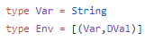

# Roy (Extensible Imperative Language) by Lazy

## Table of Contents
- [Project Description](#project-description)
  - [Abstract Syntax](#abstrac-syntax)
  - [Concrete Syntax](#concrete-syntax)  
- [Instructions](#instructions)
- [Examples](#examples)
- [Milestone 1](#milestone-1)
  - [Progress](#progress)
  - [Design Questions](#design-questions)
- [Milestone 2](#milestone-2)
  - [Progress](#progress-1)
  - [Design Decisions](#design-decisions)

## Project Description

For our project, we will create an easily user extendable imperative programming language (Roy), and implement a simple extension known as Linear Algebra Neatly Created Extension (LANCE) to demonstrate how such extensions can be done. 
Our programming language will be simple in its core features, but designed to be extended by users by allowing them to implement custom data types and operations on those data types–a plugin architecture.  In addition, we will take inspiration from SageMath and implement an example user extension that includes matrices and vectors as data types with basic operations such as dot products that can be performed on them.

The features planned for our project are:

- A simple extensible programming language that supports integers and booleans, as well as allows the user to extend the language with their own custom primitive data types and operations.
- Basic operations implemented for integers and booleans.
- Core language features including if statements, while loops, primitive operations, setting and referencing variables, and defining/calling functions.
- An interpreter for the language and it's basic features that is compatible with user added operations and data types.
- An extendable parser that can convert the languages concrete syntax to Abstract Syntax Tree (AST) that can be interpreted by the interpreter.
- An extendable type checker that can validate programs before they are ran by the interpreter.
- An example user extension to the programming language.

### Abstract Syntax

Roy has the following abstract syntax.
```
DVal ::= (Integer, Boolean, ..)   // data type for literal values

Var  ::= String           	  // variable or function names

Expr ::= Lit DVal	      	  // literals
       | Prim OpName Expr Expr	  // primitive binary operation (addition, comparison, ..)
       | Ref Var      		  // refer to a variable
       | Call Var [Var]   	  // call a named function with variables

Stmt ::= Set Var Expr	          // store to a variable
       | If Expr [Stmt]	          // conditional statement
       | While Expr [Stmt]        // loop until expression is True
       | Def Var [Stmt]	          // define a function
       | Ret Expr		  // return statement

prog ::= e | stmt; prog   	  // sequence of statements 
```

### Concrete Syntax
- Every literal should start with `$`, name for the data type and actual value.
  ```
  $ Int 1
  $ Bool True
  ```
- A keyword `var` is always required in front of variable or function name. Letters, numbers and `_` can be used for a name. 
  ```
  var Roy12_3
  ```
- To refer a variable, use `ref` keyword.
  ```
  ref var x
  ```
- To call a function, use `call` keyword and following function name and variable names. Variable names are enclosed by parentheses and each variable name is separated by a comma. 
  ```
  call var foo()
  call var bar(var x, var y)
  ```
- To execute primitive binary operation, use the operation name as keyword and following expressions enclosed by parentheses and separated by a comma.
  ```
  add ($ Int 3, $ Int 7)
  eq ($ Bool True, ref var x)
  ```
- To store an expression into a variable, start with`set` keyword and the variable name with`var` keyword, following an equal sign and the expression to be stored.
  ```
  set var x = $ Int 3
  set var y = ref var x
  set var z = call foo(var x, var y)
  ```
- When `if` and `while` statement is used, it is followed by an expression enclosed by parentheses and statements enclosed by curly braces `{...}`.
  ```
  if (eq (ref var x, ref var y)) {
     set var z = add (ref var z, $ Int 1) 
  }
  ```
- A function can be defined with `def` keyword. It is followed by function name with `var` keyword and statements enclosed by curly braces `{...}`. Note that a defined function must have at least one return statement.
  ```
  def var foo {
     set var x = $ Int 34
     ret ref var x
  }
  ```
- Return statement starts with `ret` keyword and a following expression.
  ```
  ret ref var result
  ```

## Instructions
- The project depends on the external library Parsec, and uses doctest for unit tests.  To install these, first install cabal.  Then, run the following commands:
  
  ```cabal install doctest```
 
  ```cabal install parsec```

- [RoySyntax.hs](RoySyntax.hs) holds the definitions of the data types that make up the core syntax and AST of the language.
- [RoyBase.hs](RoyBase.hs) defines the basic data types and operations in the language. The basic data types and operations are added to the language in the same way an extension would be done.
- [RoySemantics.hs](RoySemantics.hs) contains evaluation functions for expressions and statements. 
- [RoyExamples.hs](RoyExamples.hs) has example programs for the language, as well as helper functions for building example programs. 
- [RoyParser.hs](RoyParser.hs) includes parsing functions for expressions and statements.
- [RoyTests.hs](RoyTests.hs) contains doctest test cases for the evaluation functions that use the examples.  After installing doctest, the tests can be ran with the following command:

  ```doctest RoyTests.hs```

  To interact with the language, example programs, parser, and evaluation functions in GHCi, load [RoyTests.hs](RoyTests.hs) in GHCi with the following command:

  ```ghci RoyTests.hs```

 - In GHCi, you can build expressions and statements using the AST that is defined in [RoySyntax.hs](RoySyntax.hs).
   Note that DVals can be created using `(DA x)` where x is any instance of RoyDataType. Sometimes, GHCi will require you to explicitly state the type of x.
   For example, to store the integer 4 as a DVal you would need to do `(DA 4::Int)`.

 - Expressions and Statements can be evaluated using their evaluation functions.
   Their respective evaluation functions are `eval` for expressions, `stmt` for a single statement, and `stmts` for a list of statements.
   The `runFun` function is used for evaluating the result of a function (a list of statements that contains a return statement).
   Notice that each evaluation function also takes in a tuple, with the first element being a list of tuples with a variable name and a `DVal` stored in that variable, and the second element being a list of tuples with a function name, and a list of statements for that function.
   The easiest environment to start with is `([],[])`. 
   You can see many examples of these evaluation functions being used in [RoyTests.hs](RoyTests.hs).

 - You can run the parser directly in ghci by running the `parseProg` function and passing to it a string that represents the concrete syntax to parse.  Individual smaller parsers can be ran using the `runParse` function which takes as input the parser to run and the string to be parsed by that parser.
 
 - You would write a program with concrete syntax in a file. To execute a file written with Roy, compile the `Main.hs` and execute it with filename as the argument. Sample programs can be found in `examples` folder.
   ```
   $ ghc -O Main.hs
   $ ./Main filename
   ```

## Examples

- This example evaluates a simple expression that adds 3 and x when x stores the value 5.
  ```
  *RoyTests> eval (Prim "add" (Lit (DA (3::Int))) (Ref "x")) ([("x",DA (5::Int))],[])
  Just 8
  ```
  
- This example evaluates a simple list of statements that set the variables x to 4 and y to True.
  ```
  *RoyTests> stmts [Set "x" (Lit (DA (4::Int))), Set "y" (Lit (DA True))] ([],[])
  Just ([("y",True),("x",4)],[])
  ```

- `Nothing` is returned because using an if statement with a condition that is not a boolean is not allowed.
  ```
  *RoyTests> stmt (If (Lit (DA (5::Int))) [Set "x" (Lit (DA False))]) ([],[])
  Nothing
  ```

- Runs a program that takes the number 100, passes it to a function that adds 5 to it using a loop, and returns the result. 
  ```
  *RoyTests> getRet (stmts prog3 ([], []))
  Just 105
  ```

- Runs the parser with the program concrete1 as input.  Produces an AST that represents the program.  This AST can be evaluated byu the evaluation function.
  ```
  *RoyTests> parseProg concrete1
  Right [Def "foo" [Set "x" (Lit 34),Ret (Ref "x")],Set "worked" (Lit False),Set "result" (Call "foo" []),If (Prim "eq" (Ref "result") (Lit 34)) [Set "worked" (Lit True)]] 
  ```
 
- Runs above program written in a file with concrete syntax.
  ```
  $ ./Main examples/SeriesSum.roy
  Just ([("result",105),("x",100)],[("seriesSum",[Set "count" (Lit 0),Set "test" (Lit True),While (Ref "test") [Set "x" (Prim "add" (Ref "x") (Lit 1)),Set "count" (Prim "add" (Ref "count") (Lit 1)),If (Prim "eq" (Ref "count") (Lit 5)) [Set "test" (Lit False)]],Ret (Ref "x")])])
  ```
- This gives 11th number in Fibonacci sequence. It can give another Fibonacci number by changing argument in line 26
  ```
  $ ./Main examples/Fibonacci.roy
  Just ([("result",89),("x",11)],[("fib",[Set "fib1" (Lit 0),Set "fib2" (Lit 1),Set "fib3" (Lit 0),Set "cnt" (Lit 1),Set "test" (Lit True),If (Prim "eq" (Ref "x") (Lit 0)) [Set "test" (Lit False)],If (Prim "eq" (Ref "x") (Lit 1)) [Set "test" (Lit False),Set "fib3" (Lit 1)],While (Ref "test") [Set "fib3" (Prim "add" (Ref "fib1") (Ref "fib2")),Set "fib1" (Ref "fib2"),Set "fib2" (Ref "fib3"),Set "cnt" (Prim "add" (Ref "cnt") (Lit 1)),If (Prim "eq" (Ref "cnt") (Ref "x")) [Set "test" (Lit False)]],Ret (Ref "fib3")])])
  ```

## Milestone 1

### Progress

#### Current Features:
- Created the data types to represent the AST of an extensible imperative programming language.
- Implemented a basic interpreter for the existing language features. 
- Supported if statements, while loops, primitive operations, setting and referencing variables, and defining/calling functions in the AST and interpreter.
- Included support for Integers and Booleans along with a simple primitive operation for each (not all operations are implemented yet).
- Added run time error checking to the interpreter in place of the type checker.  
- Defined multiple test cases to ensure correctness in the interpreter.

#### Features to be added:
- Add more primitive operations for integers and booleans.
- Create an extendable concrete syntax and parser, and a program that links the parser to the interpreter.  
- Develop an example user extension to show that the language is extendable. 

### Design Questions
- Currently we are using a Generalised Algebraic Data Type (GADT) to represent values in our program.  That data type is called DVal.  What we accomplished with this GADT is that any instance of the type class RoyDataType can be stored in a DVal.  This allows us to have environments that hold an arbitrary number of data types.  The user can extend the amount of data types that can be held in the environment by creating new instances of RoyDataType.

  We found this created complexity for us, as our RoyDataType instances now must be Typeable, and we have to cast them from DVals back to their original types to   perform primitive operations on them.  Do you have any other suggestions for how we could accomplish having variable environments while also allowing users to extend the language with new data types?  Do you have an ideas for how we could have primitive operations with different arities?  Any other suggestions overall to improve the simplicity of our interpreter while maintaining the extensibility of the language? 

- The next steps for us will be to design a concrete syntax and implement a parser to convert concrete syntax into a list of statements.  We are looking at using the [Parsec](https://wiki.haskell.org/Parsec) library for the parser.  All of the functions that we will need to have defined to parse user created data types are included in the RoyDataType type class.  Do you have any suggestions for us when designing our parser and concrete syntax?

- Currently, returning from a function is a statement, but that statement is interpreted by the runFun function which is called by the expression evaluation function.  This feels off to me.  It feels like the stmts function and the runFun are doing the same job, but they have different return types.  Do you have any suggestions to resolve this, or improve the way that we return from functions?  Also, we can not return inside of if statements and while loops as a result.

- We're thinking of ditching having a type checker and doing our error checking at run time, as shown in our evaluation functions.  Does our error checking look sufficient so far? Are there any error cases we are missing?

## Milestone 2

### Progress

#### Current Features:
- Created the data types to represent the AST of an extensible imperative programming language.
- Implemented a basic interpreter for the existing language features. 
- Supported if statements, while loops, primitive operations, setting and referencing variables, and defining/calling functions in the AST and interpreter.
- Included support for Integers and Booleans along with a simple primitive operation for each (not all operations are implemented yet).
- Added run time error checking to the interpreter in place of the type checker. 
- Designed a concrete syntax for the language, and implemented a parser that can parse the concrete syntax and be extended to support new data types and primitive operations.
- Wrote a simple main module that takes a file as input and runs the Roy code inside it end to end. It reads the file, parses it into an AST, and evaluates the AST.
- Defined multiple test cases to ensure correctness in the interpreter and the parser.


#### Features to be added:
- Add more primitive operations for integers and booleans.
- Develop an example user extension to show that the language is extendable. 

### Design Decisions
- Currently we are using a Generalised Algebraic Data Type (GADT) to represent values in our language.  That data type is called DVal.  What we accomplished with this GADT is that any instance of the type class RoyDataType can be stored in a DVal.  RoyDataType is a type class that enforces that all instances of it will provide the information needed by the parser and interpreter.  This allows us to have environments that hold an arbitrary number of data types, and expressions that can operate on an arbitrary number of data types.  The user can extend the amount of data types that can be held in the environment by creating new instances of RoyDataType. 

  We tried other methods for making the data types in our language extendable.  The most promising attempt was making the Expr type a GADT that is parameterized by a type a.  This method would have been preferred because it would likely make our implementation of primitive operations and type checking much simpler.  However, variable references prevented this method from working.  The type of the reference data constructor was (String -> Expr a).  The interpreter would constantly give errors because it does not know what type a is, and it cannot guarantee that the type of the value coming out of the environment was of type a.

  
  
  
  
  

- We wanted for users to be able to add their own data types and their own operations that act on these data types. Our original idea was having some list containing the functions that a data type is allowed to call (a list of a (opname string, op function)). But, this restricted us to only having functions of the same type (a->a->a). This meant even simple functions like comparing two integers (Int->Int->Bool) were not possible to include. We decided make our language dynamic in nature to make this issue easier to solve. We used Data.Dynamic to store a list of functions as type Dynamic. Then, we can look up a function, use DynApply to try to apply our arguments to the function, and try to recover a DVal in the end. If it succeeds, we get our DVal. If it fails, we get Nothing. This allows us to add any binary operation (a->b->c) where a, b, and c are DVals. We could potentially extend this same strategy to operations of any arity by applying a list of arguments and checking to see if we have a DVal in the end.

- We used the library Parsec to implement the parser.  We had heard of Parsec from our classmates talking about it, but did not know how to use it.  The backup plan was to use the combinator pattern like in hasklet 2 along with a parser monad to remove some of the repeated code like we had in that hasklet.  However, once we looked into Parsec we realized that it does exactly that.  We used the combinator pattern to build our parser for Roy out of many small parsers for smaller parts of the language.  We used the parser monad constantly throughout our implementation as well.
 
- Originally, we had a separate runFunc function that returned a DVal specifically to handle the return statement. The "Call" expression in eval would call runFunc to get the return value. Although runFunc and stmts were almost identical in implementation, we had difficulty factoring out the common code because stmts returned only the environment (Env,FuncEnv) while runFunc returned a DVal. We fiddled around with the idea of having stmts return (Maybe DVal, Maybe (Env,FuncEnv)), but passing around a Maybe DVal was a little cumbersome considering most of our statements did not return any value (only the return statement). Instead, we ended up keeping the same semantic domain and made return add a "\_ret" variable into the environment. Then, the "Call" expression would reference the "\_ret" variable. This allowed us to cleanly unify runFunc and stmts, also solving the issue of returns not working in If/While statements.
